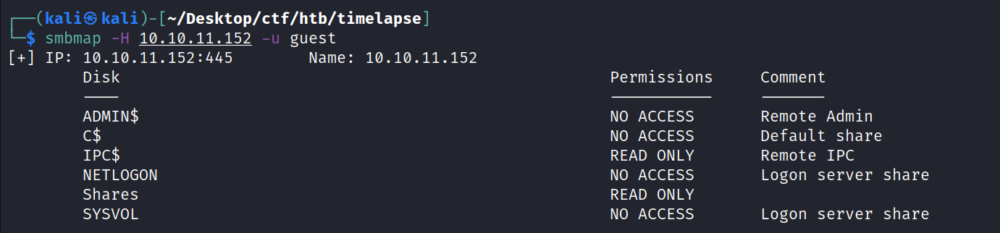
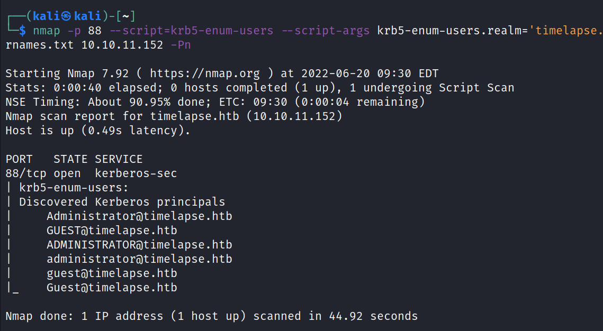

<h1>Timelapse(Window)</h1>

 

impacket-lookupsid anonymous@10.10.11.152

Impacket v0.10.1.dev1+20220606.123812.ac35841f - Copyright 2022
SecureAuth Corporation

Password:

\[\*\] Brute forcing SIDs at 10.10.11.152

\[\*\] StringBinding ncacn_np:10.10.11.152\[\pipe\lsarpc\]

\[\*\] Domain SID is: S-1-5-21-671920749-559770252-3318990721

498: TIMELAPSE\Enterprise Read-only Domain Controllers (SidTypeGroup)

500: TIMELAPSE\Administrator (SidTypeUser)

501: TIMELAPSE\Guest (SidTypeUser)

502: TIMELAPSE\krbtgt (SidTypeUser)

512: TIMELAPSE\Domain Admins (SidTypeGroup)

513: TIMELAPSE\Domain Users (SidTypeGroup)

514: TIMELAPSE\Domain Guests (SidTypeGroup)

515: TIMELAPSE\Domain Computers (SidTypeGroup)

516: TIMELAPSE\Domain Controllers (SidTypeGroup)

517: TIMELAPSE\Cert Publishers (SidTypeAlias)

518: TIMELAPSE\Schema Admins (SidTypeGroup)

519: TIMELAPSE\Enterprise Admins (SidTypeGroup)

520: TIMELAPSE\Group Policy Creator Owners (SidTypeGroup)

521: TIMELAPSE\Read-only Domain Controllers (SidTypeGroup)

522: TIMELAPSE\Cloneable Domain Controllers (SidTypeGroup)

525: TIMELAPSE\Protected Users (SidTypeGroup)

526: TIMELAPSE\Key Admins (SidTypeGroup)

527: TIMELAPSE\Enterprise Key Admins (SidTypeGroup)

553: TIMELAPSE\RAS and IAS Servers (SidTypeAlias)

571: TIMELAPSE\Allowed RODC Password Replication Group (SidTypeAlias)

572: TIMELAPSE\Denied RODC Password Replication Group (SidTypeAlias)

1000: TIMELAPSE\DC01\$ (SidTypeUser)

1101: TIMELAPSE\DnsAdmins (SidTypeAlias)

1102: TIMELAPSE\DnsUpdateProxy (SidTypeGroup)

1601: TIMELAPSE\thecybergeek (SidTypeUser)

1602: TIMELAPSE\payl0ad (SidTypeUser)

1603: TIMELAPSE\legacyy (SidTypeUser)

1604: TIMELAPSE\sinfulz (SidTypeUser)

1605: TIMELAPSE\babywyrm (SidTypeUser)

1606: TIMELAPSE\DB01\$ (SidTypeUser)

1607: TIMELAPSE\WEB01\$ (SidTypeUser)

1608: TIMELAPSE\DEV01\$ (SidTypeUser)

2601: TIMELAPSE\LAPS_Readers (SidTypeGroup)

3101: TIMELAPSE\Development (SidTypeGroup)

3102: TIMELAPSE\HelpDesk (SidTypeGroup)

3103: TIMELAPSE\svc_deploy (SidTypeUser)

 

**from begin part copy both files in**

**key and cert**

 

 