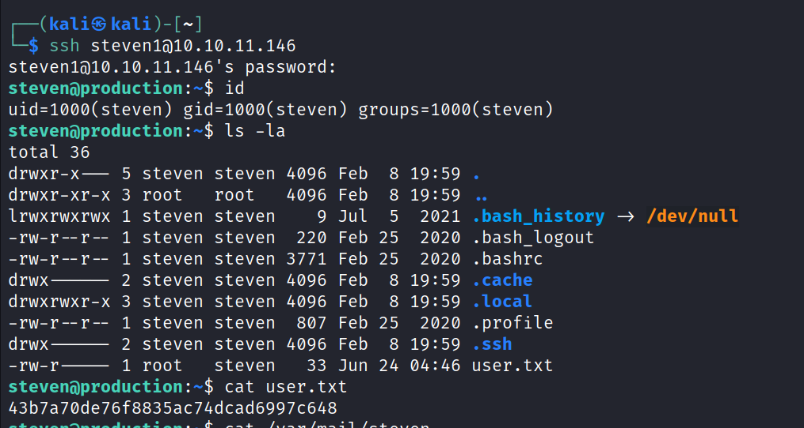
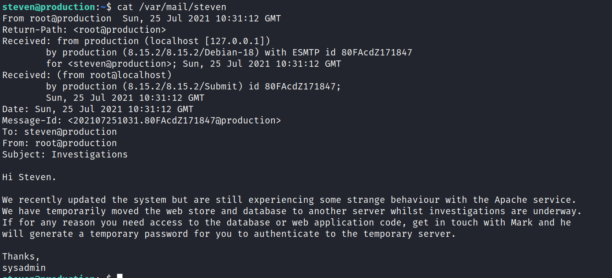
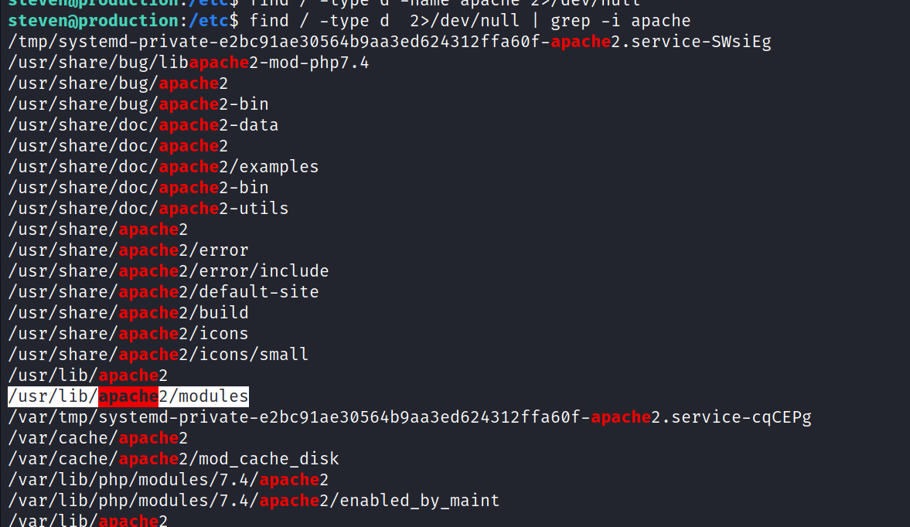
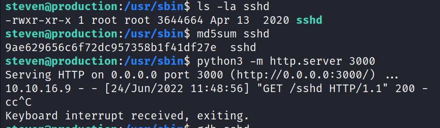

<h1>Undetected</h1>

crontab

since strngs command not working in the attaking machine so transfer it
to own machine
and use strings command
strings info

use ssh

sort by latest file

strings mod_reader.so

On Ghidra

highlighted binary is invalid so we check the binary

arrange in decending order

